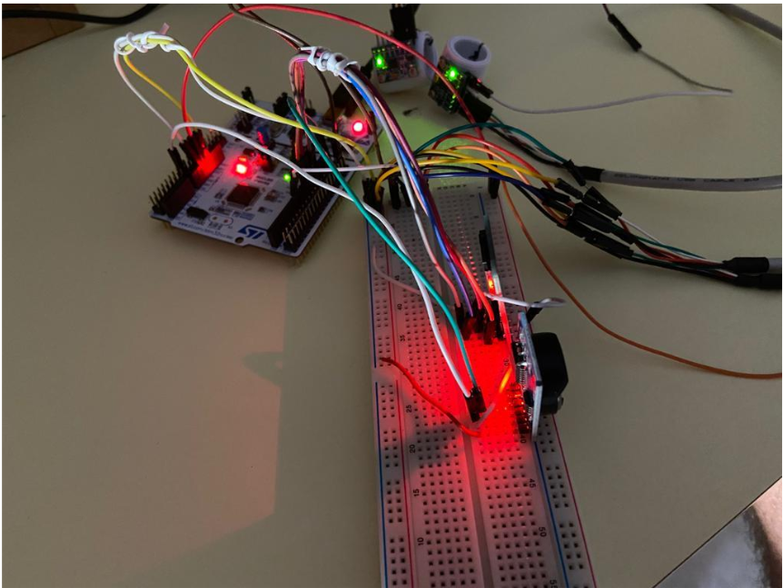
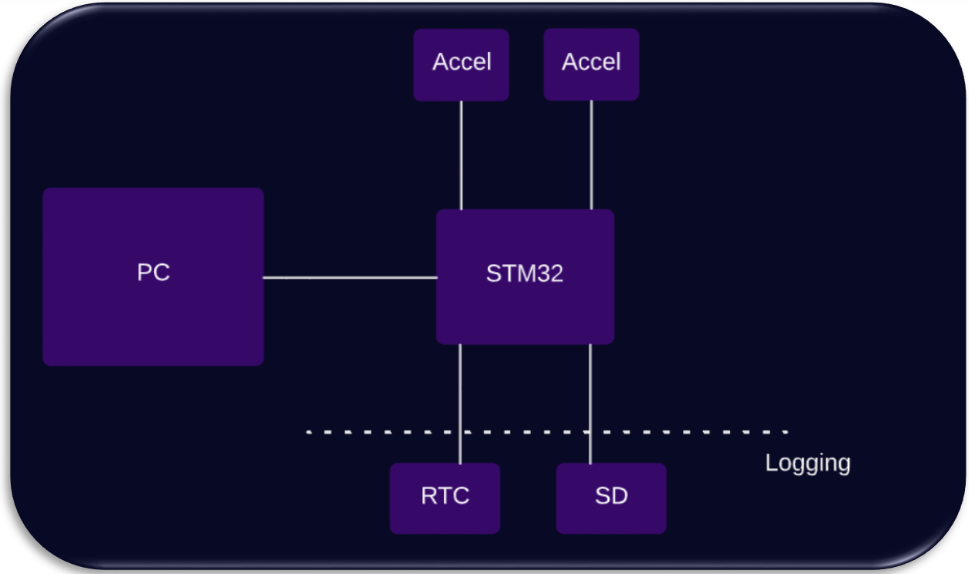
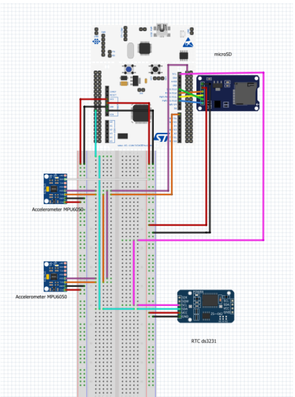

# Air Mouse System Fingers Based

  

## Overview
The **Air Mouse System Fingers Based** project involves the creation of a gesture-controlled mouse using a combination of accelerometers, gyroscopes, a real-time clock (RTC), and an SD card module. The goal is to allow users to control their computer's mouse cursor by moving their fingers in the air, creating patterns and gestures for various actions, like movement, click, double-click etc.

## Developed System 
For the realisation of the Air Mouse, it was necessary to: 
- create a system capable of interpreting the basic commands of a common mouse, like **single click**, **double click**, **zoom in**, **zoom out**, **ALT-TAB**, with a specific fingers movement, acquiring data from accelerometers;
- create a system capable of **recording each event** (e.g. movement) by acquiring the timestamp from the RTC and writing it to the SD card witha representation such as: from:(x,y,z); to:(x,y ,z); accel: (x,y,z); gyro: (x,y,z) etc.;
- define different tasks for different activities(log, sensors' input, etc.), employing FreeRTOS, eventually with time constraints;
- design a suitable communication protocol from the STM32-Air mouse to the PC;
- define a calibration procedure.
- create a system that is correct, verifiable, modular and easily maintainable but also ready and fluid in responding to finger movements.

### Hardware
#### Hardware Components
- STM32F401RET6 board from the Nucleo series;
- 2 Modulo GY-521, build to manage MPU-6050, which combines an 3-axis accelerometer, a 3-axis gyroscope, a temperature sensor, an internal clock oscillation and a digital motion processor (DMP);
- Real-Time Clock (RTC) DS3231;
- Micro SD card adapter module;
#### Hardware Architecture
As can be seen in the high-level hardware architecture, it was necessary to interface the board and thus the processor with external peripherals. The board in turn is connected to the PC to which, as soon as the code has been loaded, it will transmit the data obtained, which will be reflected in mouse movements.  This data will be obtained by processing the values measured by the accelerometers along the three axes. The other two sensors, namely the RTC and the SD are functional to the development of a log file, saved on an SD card contained within the SD module. Specifically, the Real Time Clock is required to obtain a timestamp, so that all recorded movements and their associated values can be documented on the file, placing them temporally.

  

As can be seen in the low-level hardare architecture, it was necessary to make use of a breadbord. 

  

For more details on the description of the connections made, please refer to the [report](ProgettoFinale_SE.pdf).

### Communication interface
Both the Real Time Clock and the two Accelerometers require I2C channels for communication with the board. So it was necessary to realise a protocol scheme that allows data acquisition from all sensors without creating overlaps. To this end, the board's availability of more than one I2C channel was exploited, as well as the possibility associated with the accelerometers alone, to be able to set up a register shift through which the
master can communicate with them. So that there was no overlap between the values communicated by the two different accelerometers. The microSD reader, on the other hand, uses an SPI connection. The communication with the PC is established through USART/UART, using a USB connection.
For more details about these comunication protocols, please refer to the [report](ProgettoFinale_SE.pdf).

### Software
#### Software Components
- STM32CubeIDE, an all-in-one multi-OS development tool, part of the STM32Cube software ecosystem;
- FreeRTOS, a space-saving, portable and open source real-time operating system (RTOS) for microcontrollers.
- PyAutoGUI, a Python GUI automation module cross-platform for humans, used to control at the code level the mouse and keyboard, and very useful to translate accelerometer values into mouse movements.
- PySerial, a module encapsulating the access for the serial port, that is useful to realise communication with the STM32 board so that motion commands can be acquired through the UART communication protocol.

#### Software Architecture
The software architecture was realised by identifying three tasks of freeRTOS with the same priority and different functionalities. The implemented tasks were identified from the
main functionalities that were to be offered by the system. So, a first *LectureTask* was implemented for the acquisition of data from accelerometers, which has a stack size of 128 words and whose priority is RealTime. The second task *AnalysisTask*, with a stack size of 128 words and a RealTime priority, deputed to recognize, depending on the values obtained from the accelerometers, which movement has to be made and send that analysis to the UART so that it can then communicate with the python modules to execute the user's commands. The third *LogTask* task, on the other hand, is responsible for writing the log file to the SD card and has a stack larger stack size of 2048 words and a RealTime priority. So, the read task is a periodic task. The activity of the other two tasks, on the other hand, depends on the presence of values to be parsed within the queues. Specifically, the queues created
were two: the first *LtoAqueue* serves as the
connection between the read task and the analysis task, the second *AtoLogqueue* serves as the connection between the analysis task and the log task. 

The control software was realised in C, for more details on the implemented modules, please refer to the [report](ProgettoFinale_SE.pdf).

## Repository Structure
- `ConfigTrio_RTC_1A2ASisEmbFinalProject/`: contains all the code developed for the system;
- `ProvaMouse`: contains a python script to test the system;
- `FinalProjectSistEmbBreadboard.fzz` and `SchemaConnessioni.fzz`: are the projects of the connection schemes;
- `ProgettoFinale_SE.pdf`: is the final report containing descriptive diagrams of the realised architecture, the motivations underlying certain design choices, details of the developed modules, hardare and software components descriptions and images depicting how to use the system;

## DEMO 
[Here](https://youtu.be/58L7y2n-bBM) it is possible to see a demo video of the developed system and all the implemented features.

## Feedback
For any feedback, questions or inquiries, please contact the project maintainers listed in the Contributors section.
